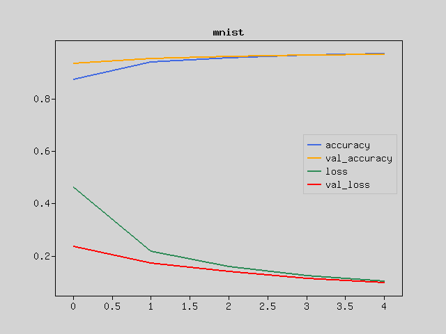

- [Operating environment](#operating-environment)
- [Installation procedure for Windows](#installation-procedure-for-windows)
- [Installation procedure for Ubuntu](#installation-procedure-for-ubuntu)
- [GPU/OpenCL support](#gpuopencl-support)

Operating environment
---------------------
Rindow Neural Networks has been tested in the following operating environment.

- PHP 8.0, 8.1 (If you want to use it on PHP 7.x environment, please use Release 1.x.)
- Windows 10 20H2 or later.
- Ubuntu 18.04, 20.04, 22.04
- AMD/Intel CPU/APU 64bit(SSE2 or later)
- OpenBLAS (0.3.20 Windows-x64, 0.3.20 Ubuntu-2204, 0.3.8 Ubuntu-2004, 0.2.20 Ubuntu-1804)
- CLBlast  (1.5.2 Windows-x64)

It will also work on Intel CPUs and Integrated Graphics with OpenCL Drivers.

Installation procedure for Windows
----------------------------------
PHP installation

For Windows 10/11, install PHP for Windows.

+ Download the PHP8.0 (or 8.1) x64 Thread Safe version from https://windows.php.net/download/.
+ Unzip to the location of your choice.
+ Copy php.ini-development to create php.ini.
+ Set the execution PATH for PHP.EXE.
+ Make sure PHP works with PHP -v.

```shell
C:TEMP>COPY C:\php\php81\php.ini-development C:\php\php81\php.ini

Edit php.ini to your liking.

C:TEMP>PATH %PATH%;C:\php\php81
C:TEMP>php -v
PHP 8.1.7 (cli) (built: Jun  7 2022 21:45:53) (ZTS Visual C++ 2019 x64)
Copyright (c) The PHP Group
Zend Engine v4.1.7, Copyright (c) Zend Technologies
    with Zend OPcache v8.1.7, Copyright (c), by Zend Technologies
C:TEMP>
```

Install composer.

+ Download composer from https://getcomposer.org/download/.
+ Copy composer.phar to the directory where the execution PATH is set.
+ Create composer.bat in the same location.

```shell
C:TEMP>COPY composer.phar C:\bin
C:TEMP>CD \bin
C:bin>echo @php "%~dp0composer.phar" %*>composer.bat
```

Install the required PHP extensions for Rindow Neural Networks.

+ Download and unzip the latest version of rindow_openblas from https://github.com/rindow/rindow-openblas/releases.
+ Download and unzip OpenBLAS with the release number to corresponding the rindow-openblas from https://github.com/xianyi/OpenBLAS/releases. The compatible OpenBLAS Library release number is included in the filename of the rindow-openblas pre-built archive file. If you use the wrong OpenBLAS release number DLL, it will not work properly.
+ Set the OpenBLAS DLL path to the execution path.
+ Copy php_rindow_openblas.dll to PHP's ext directory.
+ Make the necessary settings in php.ini.
     - memory_limit = 8G
     - extension = rindow_openblas
     - extension = pdo_sqlite
     - extension = gd
     - extension = mbstring
     - extension = openssl
+ Make sure rindow_openblas is loaded with PHP -m.

```shell
C:TEMP>PATH %PATH%;C:\OpenBLAS\OpenBLAS-0.3.20-x64\bin
C:TEMP>COPY rindow-openblas-php8.1-0.3.0-openblas0.3.20-win-ts-vs16-x64\php_rindow_openblas.dll C:\php\php-8.1.7-Win32-vs16-x64\ext

Edit php.ini

C:TEMP>php -m
[PHP Modules]
...
pdo_sqlite
...
rindow_openblas
...
C:TEMP>
```

Install Rindow Neural Networks.

+ Create your project directory.
+ Install rindow / rindow-neural networks with composer.
+ Install rindow / rindow-math-plot with composer for graph display.
+ Run the sample and check the operation.
+ The result is displayed as a graph.

```shell
C:TEMP>MKDIR \tutorials
C:TEMP>CD \tutorials
C:tutorials>composer require rindow/rindow-neuralnetworks
C:tutorials>composer require rindow/rindow-math-plot
C:tutorials>MKDIR samples
C:tutorials>CD samples
C:tutorials\samples>COPY ..\vendor\rindow\rindow-neuralnetworks\samples\* .
C:tutorials\samples>php mnist-basic-clasification.php
Downloading train-images-idx3-ubyte.gz ...Done
....
Epoch 4/5 ........................ - 10 sec.
 loss:0.1276 accuracy:0.9641 val_loss:0.1162 val_accuracy:0.9649
Epoch 5/5 ........................ - 11 sec.
 loss:0.1063 accuracy:0.9703 val_loss:0.1059 val_accuracy:0.9688

The graph is displayed
```

Installation procedure for Ubuntu
---------------------------------

Install php.

+ Install php-cli, php-mbstring, gd and unzip with the apt command.

```shell
$ sudo apt install php-cli8.1 php8.1-mbstring php8.1-sqlite3 php8.1-gd unzip
$ php -v
PHP 8.1.7 (cli) (built: Jun 10 2022 12:23:36) (NTS)
Copyright (c) The PHP Group
Zend Engine v4.1.7, Copyright (c) Zend Technologies
    with Zend OPcache v8.1.7, Copyright (c), by Zend Technologies
```

Install composer.

+ Download composer from https://getcomposer.org/download/.
+ Copy composer.phar to the directory where the execution PATH is set.
+ Make composer in the same place.

```shell
$ cp composer.phar ~/.local/bin
$ cd ~/.local/bin
$ cat > composer
#!/usr/bin/env sh
dir=$(cd "${HOME}/.local/bin" && pwd)
php "${dir}/composer.phar" "$@"
^D
$ chmod +x composer
$ composer -V
Composer version 2.3.7 2022-06-06 16:43:28
```

Install the required PHP extensions for Rindow Neural Networks.

+ Download the latest version of rindow_openblas from https://github.com/rindow/rindow-openblas/releases.
+ Install the downloaded deb file with the apt command.
+ Make sure rindow_openblas is loaded with PHP -m.

```shell
$ sudo apt install ./rindow-openblas-php8.1_0.3.0-1+ubuntu22.04_amd64.deb
$ php -m
[PHP Modules]
...
rindow_openblas
...
```

Install Rindow Neural Networks.

+ Set the image display command of rindow-math-plot.
+ Create your project directory.
+ Install rindow / rindow-neural networks with composer.
+ Install rindow / rindow-math-plot with composer for graph display.
+ Run the sample and check the operation.
+ The result is displayed as a graph.

```shell
$ RINDOW_MATH_PLOT_VIEWER=/some/bin/dir/png-file-viewer
$ export RINDOW_MATH_PLOT_VIEWER
$ mkdir ~/tutorials
$ cd ~/tutorials
$ composer require rindow/rindow-neuralnetworks
$ composer require rindow/rindow-math-plot
$ mkdir samples
$ cd samples
$ cp ../vendor/rindow/rindow-neuralnetworks/samples/* .
$ php basic-image-clasification.php
Downloading train-images-idx3-ubyte.gz ...Done
....
Epoch 4/5 ........................ - 10 sec.
 loss:0.1276 accuracy:0.9641 val_loss:0.1162 val_accuracy:0.9649
Epoch 5/5 ........................ - 11 sec.
 loss:0.1063 accuracy:0.9703 val_loss:0.1059 val_accuracy:0.9688
```
Note: Specify "viewnior" etc. for RINDOW_MATH_PLOT_VIEWER

The result is displayed as a graph.




GPU/OpenCL support
------------------

Download binaries and setup PHP extension and libraries.

- [Rindow OpenCL extension](https://github.com/rindow/rindow-opencl/releases)
- [Rindow CLBlast extension](https://github.com/rindow/rindow-clblast/releases)
- [CLBlast library](https://github.com/CNugteren/CLBlast/releases)

Set environment variable.

```shell
C:TEMP>PATH %PATH%;C:\CLBlast\CLBlast-1.5.2-Windows-x64\lib
C:TEMP>COPY rindow_opencl-php81-0.1.4-win-ts-vs16-x64\php_rindow_opencl.dll C:\php\php-8.1.7-Win32-vs16-x64\ext
C:TEMP>COPY rindow_clblast-php81-0.1.2-clblast1.5.2-win-ts-vs16-x64\php_rindow_clblast.dll C:\php\php-8.1.7-Win32-vs16-x64\ext

C:tutorials>RINDOW_NEURALNETWORKS_BACKEND=rindowclblast::GPU
C:tutorials>export RINDOW_NEURALNETWORKS_BACKEND
C:tutorials>cd samples
C:samples>php basic-image-clasification.php
```
Note: For RINDOW_NEURALNETWORKS_BACKEND, you can specify OpenCL device type or a set of Platform-ID and Device-ID in addition to names such as rindowclblast.  For example;
- rindowclblast       => platform #0, device #0
- rindowclblast::GPU  => GPU type device: Integrated GPU, etc.
- rindowclblast::CPU  => CPU type device: pocl-opencl-icd, etc.
- rindowclblast::0,0  => platform #0, device #0
- rindowclblast::0,1  => platform #0, device #1
- rindowclblast::1,0  => platform #1, device #0

[Read how to use the builders =>](builders.html)
